<h2>TensorFlow-FlexUNet-Image-Segmentation-UCSF-PDGM-Multimodal-Subset (2026/09/17)</h2>
Sarah T. Arai 
Software Laboratory antillia.com   
This is the first experiment in Image Segmentation for <b>UCSF-PDGM (UCSF Preoperative Diffuse Glioma MR) Filtered 
Multimodal Subset </b>
 based on
our <a href="https://github.com/sarah-antillia/TensorFlow-FlexUNet-Image-Segmentation-Model">TensorFlowFlexUNet Model</a>
 (<b>TensorFlow Flexible UNet Image Segmentation Model for Multiclass</b>) and a 256x256-pixel <b>NPY images containing the four modalities
  (FLAIR, T1, T1c, and T2)</b> and 
 <b>PNG masks </b>
 <a href="https://drive.google.com/file/d/182BeqlJKKVEWws0AZLqGIeu5ksTU7BGg/view?usp=sharing">
UCSF-PDGM-Multimodal-ImageMask-Subset.zip</a> with colorized masks 
(<a href="https://creativecommons.org/licenses/by-sa/4.0/">CC BY-SA 4.0</a>),
  which was derived by us from the Kaggle website 
  
<a href="https://www.kaggle.com/datasets/rukiyeaydn/ucsf-pdgm-filtered">
<b>UCSF-PDGM Filtered</b>
</a> 
 Glioblastoma MRI Dataset for Brain Tumor Segmentation
 by Rukiye Aydın.
  
For comparison of segmentation performance between a single-modal and this multimodal FlexUNet model, 
please see also the following experiments:
<ul>
<li>
 <a href="https://github.com/sarah-antillia/TensorFlow-FlexUNet-Image-Segmentation-UCSF-PDGM-FLAIR-Subset">
TensorFlow-FlexUNet-Image-Segmentation-UCSF-PDGM-FLAIR-Subset
</a>
</li>
<li>
 <a href="https://github.com/sarah-antillia/TensorFlow-FlexUNet-Image-Segmentation-UCSF-PDGM-Multimodal-Combined-Subset">
TensorFlow-FlexUNet-Image-Segmentation-UCSF-Multimodal-Combined-Subset
</a>
</li>
</ul>
 

<b>Actual Image Segmentation for UCSF-PDGM-Multimodal Images of 256x256 pixels</b> 
As shown below, the inferred masks resemble the ground-truth masks.  
 
<a href="#1"><b>class_color_mapping_table</b></a> 
 
<table>
<tr>
<th  width="320" height="auto">T2 slice in NPY</th>
<th  width="320" height="auto">Mask (ground_truth)</th>
<th  width="320" height="auto">Prediction: inferred_mask</th>
</tr>
<tr>
<td>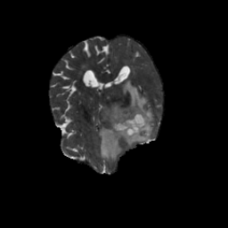</td>
<td></td>
<td>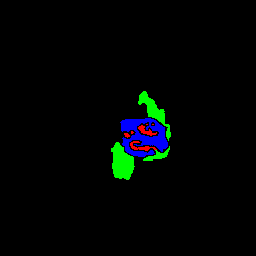</td>
</tr>
<tr>
<td>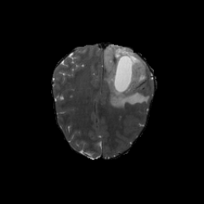</td>
<td></td>
<td>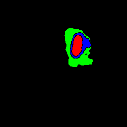</td>
</tr>
<tr>
<td>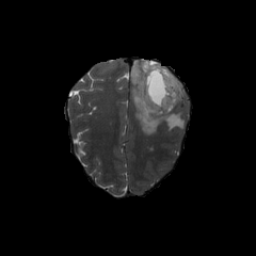</td>
<td>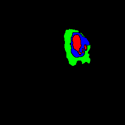</td>
<td></td>
</tr>
</table>

 
<h3>1. Dataset Citation</h3>
The dataset used here was derived from the following Kaggle website:  
<a href="https://www.kaggle.com/datasets/rukiyeaydn/ucsf-pdgm-filtered">
<b>UCSF-PDGM Filtered</b>
</a> 
 Glioblastoma MRI Dataset for Brain Tumor Segmentation
 by Rukiye Aydın.
  
The following explanation was taken from the website above.
  
<b>Abstract</b> 
This dataset is a curated subset of the <b>UCSF Preoperative Diffuse Glioma MRI (UCSF-PDGM)</b> v5 
dataset, originally published by Calabrese et al. (2022) and hosted on 
The Cancer Imaging Archive (TCIA). The original dataset contains 501 patients with 
histopathologically confirmed WHO grade II–IV diffuse gliomas, 
imaged preoperatively on a standardized 3 Tesla MRI protocol at the University of 
California San Francisco.
 
 
From the original dataset, only the following five files per patient were retained for use 
in multimodal survival prediction research:
<ul>
<li>T1-weighted image (T1)</li>
<li>T1 post-contrast image (T1c)</li>
<li>T2-weighted image (T2)</li>
<li>T2/FLAIR image (FLAIR)</li>
<li>Multicompartment tumor segmentation mask (tumor_segmentation)</li>
</ul>
 
All other modalities (DWI, SWI, ASL, DTI, HARDI) were excluded to reduce storage size from 142 GB to approximately 6.3 GB, 
while retaining all information necessary for deep learning-based feature extraction 
and survival modeling.
  
<b>Original Citation:</b> 
Calabrese, E., Villanueva-Meyer, J., Rudie, J., Rauschecker, A., Baid, U., Bakas, S., Cha, S., 
 Mongan, J., Hess, C. (2022).  
The University of California San Francisco Preoperative Diffuse Glioma MRI (UCSF-PDGM) (Version 5) [dataset]. 
 The Cancer Imaging Archive. <a href="https://doi.org/10.7937/tcia.bdgf-8v37">
 https://doi.org/10.7937/tcia.bdgf-8v37</a>
   
<b>License</b> 
<a href="<a href="https://creativecommons.org/licenses/by-sa/4.0/">
CC BY-SA 4.0</a>.
 
 
<h3>
2. UCSF-PDGM-Multimodal-ImageMask-Subset
</h3>
<h3>2.1 Download ImageMask Dataset</h3>
 If you would like to train this UCSF-PDGM-Multimodal Segmentation model,
 please download the dataset from Google Drive  
 <a href="https://drive.google.com/file/d/182BeqlJKKVEWws0AZLqGIeu5ksTU7BGg/view?usp=sharing">
UCSF-PDGM-Multimodal-ImageMask-Subset.zip</a> ( <a href="<a href="https://creativecommons.org/licenses/by-sa/4.0/">
CC BY-SA 4.0</a>). 
Expand the downloaded ImageMaskDataset and put it under the <b>./dataset</b> folder
 
<pre>
./dataset
└─UCSF-PDGM-Multimodal-Subset
    ├─test
    │   ├─images
    │   └─masks
    ├─train
    │   ├─images
    │   └─masks
    └─valid
         ├─images
         └─masks
</pre>
 
<b>UCSF-PDGM-Multimodal Statistics</b> 
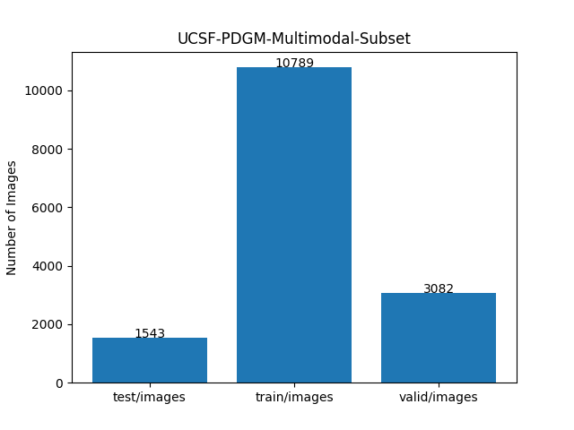 
 
As shown above, the number of images in the training and validation datasets is large enough to use for the
 training set of our segmentation model.
 
 
<h3>2.2 Derivation of UCSF-PDGM-Multimodal </h3>
The original dataset's folder structure is as follows.
It contains four modalities (FLAIR, T1, T1c, and T2) of NIfTI files and one corresponding type of NIfTI segmentation files,
but we used a subset (half of the original) in this experiment.
<pre>
./UCSF-PDGM-Filtered  
    ├─UCSF-PDGM-0004_nifti
    │   ├─UCSF-PDGM-0004_FLAIR.nii
    │   ├─UCSF-PDGM-0004_T1.nii
    │   ├─UCSF-PDGM-0004_T1c.nii
    │   ├─UCSF-PDGM-0004_T2.nii
    │   └─UCSF-PDGM-0004_tumor_segmentation.nii
...
    └─UCSF-PDGM-0541_nifti
         ├─UCSF-PDGM-0541_FLAIR.nii
         ├─UCSF-PDGM-0541_T1.nii
         ├─UCSF-PDGM-0541_T1c.nii
         ├─UCSF-PDGM-0004_T2.nii
         └─UCSF-PDGM-0541_tumor_segmentation.nii
</pre>
We generated a 256x256-pixel <b>NPY images containing the four modalities</b> and <b>PNG masks</b> dataset using the Python script
<a href="./generator/MultimodalImageMaskDatasetGenerator.py">
MultimodalImageMaskDatasetGenerator.py</a>. 
However, for simplicity, we excluded all black empty masks and the corresponding images because they are irrelevant for 
training our segmentation model. 
We also used the following class_color_mapping table to generate the colorized masks.
  
<a id="1"><b>class_color_mapping_table</b></a>
  
<table border=1 style='border-collapse:collapse;' cellpadding='5'>
<tr><th>Indexed Color</th><th>Color</th><th>RGB</th><th>Class</th></tr>
<tr><td>1</td><td with='80' height='auto'></td><td>(255, 0, 0)</td>
<td>Non-enhancing Tumor Core / Necrosis: NET/NCR</td></tr>
<tr><td>2</td><td with='80' height='auto'></td><td>(0, 255, 0)</td>
<td>Peritumoral Edema: ED</td></tr>
<tr><td>3</td><td with='80' height='auto'></td><td>(0, 0, 255)</td>
<td>GD-Enhancing Tumor: ET</td></tr>
</table>
 

<h3>2.3 Train Sample Images and Masks</h3>
<b>Train_sample_T2_slices in NPY </b> 
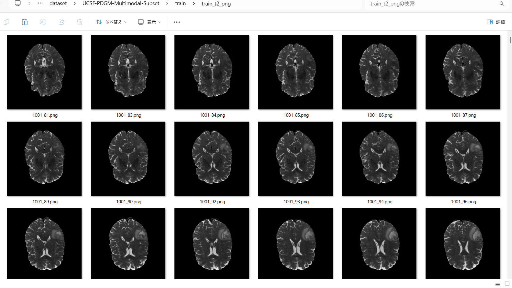
 
<b>Train_sample_masks</b> 
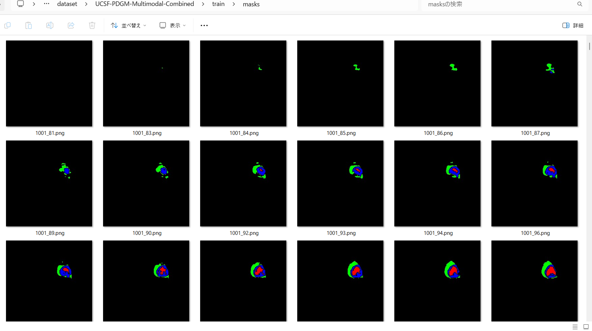
 
<h3>
3. Train TensorFlowFlexUNet Model
</h3>
 We trained the UCSF-PDGM-Multimodal TensorFlowFlexUNet model using the following
<a href="./projects/TensorFlowFlexUNet/UCSF-PDGM-Multimodal-Subset/train_eval_infer.config"> <b>train_eval_infer.config</b></a> file.  
Please move to ./projects/TensorFlowFlexUNet/UCSF-PDGM-Multimodal and run the following bat file. 
<pre>
>1.train.bat
</pre>
This simply runs the following command. 
<pre>
>python ../../../src/TensorFlowFlexUNetTrainer.py ./train_eval_infer.config
</pre>

<b>Model parameters</b> 
Defined a small <b>base_filters=16 </b> and large <b>base_kernels=(11,11)</b> for the first Conv Layer of Encoder Block of 
<a href="./src/TensorFlowFlexUNet.py">TensorFlowFlexUNet.py</a> 
and a large <b>num_layers=8</b> (including a bridge between Encoder and Decoder Blocks).
<pre>
[model]
; You may specify your own UNet class derived from our TensorFlowFlexModel
model         = "TensorFlowFlexUNet"
generator     =  False
image_width    = 256
image_height   = 256
; Specify the number of modalities (FLAIR, T1,T1c,T2)
image_channels = 4

num_classes    = 4
base_filters   = 16
base_kernels   = (11,11)
num_layers     = 8
dropout_rate   = 0.05
dilation       = (1,1)
</pre>
<b>Learning rate</b> 
Defined a small learning rate.  
<pre>
[model]
learning_rate  = 0.00007
</pre>
<b>Loss and metrics functions</b> 
Specified "categorical_crossentropy" and <a href="./src/dice_coef_multiclass.py">"dice_coef_multiclass"</a>. 
<pre>
[model]
loss           = "categorical_crossentropy"
metrics        = ["dice_coef_multiclass"]
</pre>
<b>Dataset class</b> 
Specifed <a href="./src/ImageCategorizedMaskDataset.py">ImageCategorizedMaskDataset</a> class. 
<pre>
[dataset]
class_name    = "ImageCategorizedMaskDataset"
</pre>
 
<b>Learning rate reducer callback</b> 
Enabled the learning_rate_reducer callback and a small reducer_patience.
<pre> 
[train]
learning_rate_reducer = True
reducer_factor     = 0.4
reducer_patience   = 4
</pre>
<b>Early stopping callback</b> 
Enabled early stopping callback with the patience parameter.
<pre>
[train]
patience      = 10
</pre>
<b>Image</b> 
Please specify "NPY" for <b>file_format</b> in case of an NPY image dataset.
<pre>
[image]
color_order = "RGB"
file_format = "NPY"
</pre>
 
<b>RGB Color map</b> 
Specified RGB color map dict for UCSF-PDGM-Multimodal 1+4 classes. 
<pre>
[mask]
mask_datatyoe    = "categorized"
mask_file_format = ".png"
; UCSF-PDGM-Multimodal RGB color map dict for 1+3 classes.
;        Background: black, NET/NCR: red, ED: green, ET: blue 
rgb_map = {(0,0,0):0,(255,0,0):1, (0,255,0):2,(0,0,255):3,}
</pre>

<b>Epoch change inference callback</b> 
Enabled <a href="./src/EpochChangeInferencer.py">epoch_change_infer callback</a></b>. 
<pre>
[train]
epoch_change_infer       = True
epoch_change_infer_dir   =  "./epoch_change_infer"
num_infer_images         = 6
</pre>

By using this callback, on every epoch_change, the inference procedure can be called
 for 6 images in the <b>mini_test</b> folder. This will help you confirm how the predicted mask changes 
 at each epoch during your training process.  
  
As shown below, early in the model training, the predicted masks from our UNet segmentation model showed 
discouraging results.
 However, as training progressed through the epochs, the predictions gradually improved. 
   
 
<b>Epoch_change_inference output at starting (epoch 1,2,3)</b> 
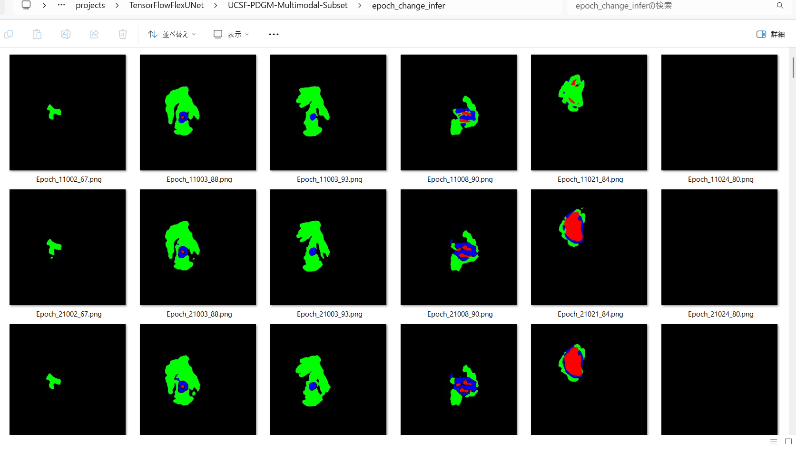 
 
<b>Epoch_change_inference output at middlepoint (epoch 26,27,28)</b> 
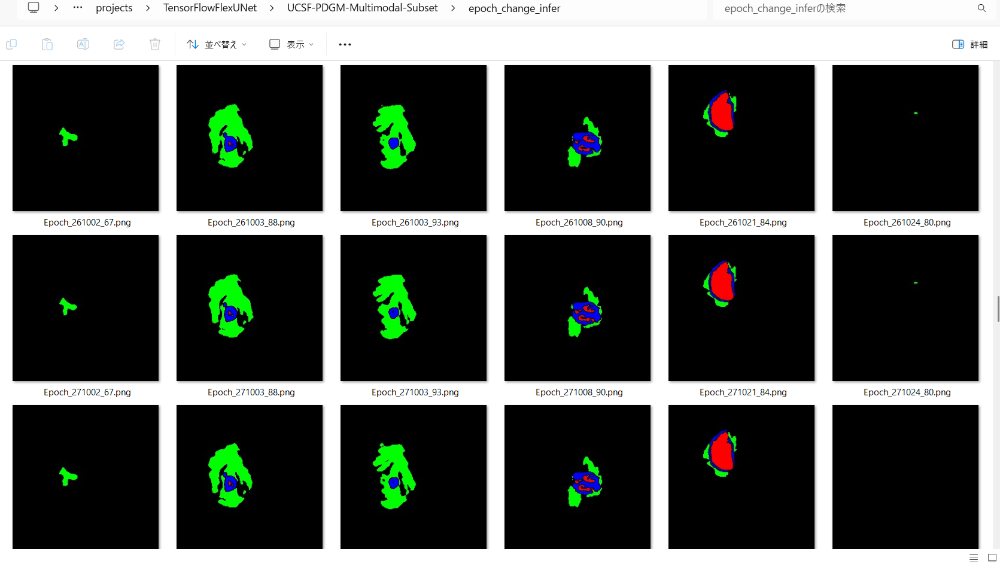 
 
<b>Epoch_change_inference output at ending (epoch 53,54,55)</b> 
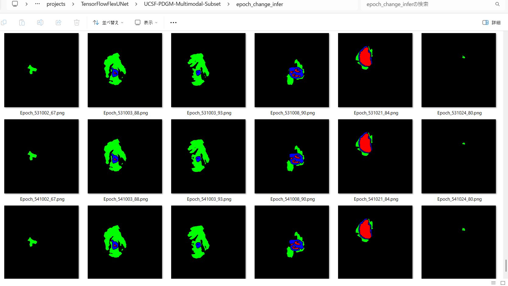 
 
In this experiment, the training process was terminated at epoch 55. 
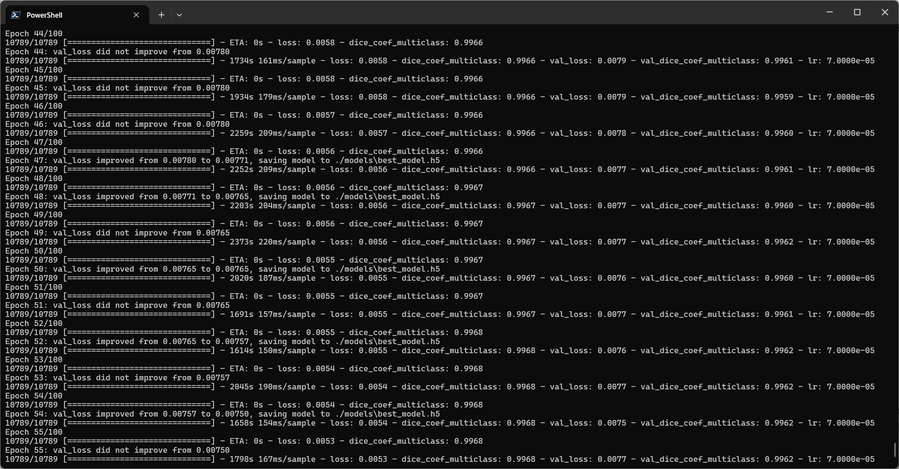 
 
<a href="./projects/TensorFlowFlexUNet/UCSF-PDGM-Multimodal-Subset/eval/train_metrics.csv">train_metrics.csv</a> 
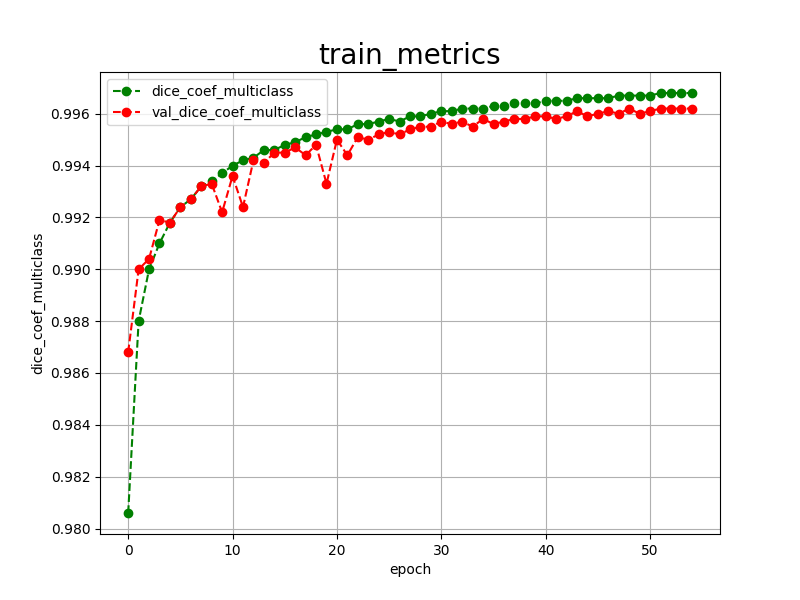 
 
<a href="./projects/TensorFlowFlexUNet/UCSF-PDGM-Multimodal-Subset/eval/train_losses.csv">train_losses.csv</a> 
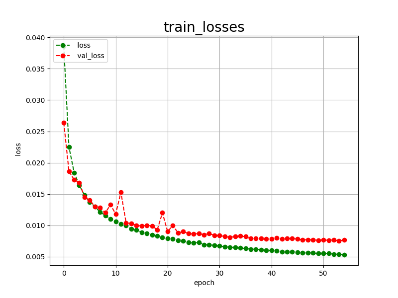 
 
<h3>
4. Evaluation
</h3>
Please move to <b>./projects/TensorFlowFlexUNet/UCSF-PDGM-Multimodal</b> folder,
and run the following bat file to evaluate the TensorFlowUNet model for UCSF-PDGM-Multimodal. 
<pre>
>./2.evaluate.bat
</pre>
This simply runs the following command.
<pre>
>python ../../../src/TensorFlowFlexUNetEvaluator.py ./train_eval_infer.config
</pre>

Evaluation console output: 
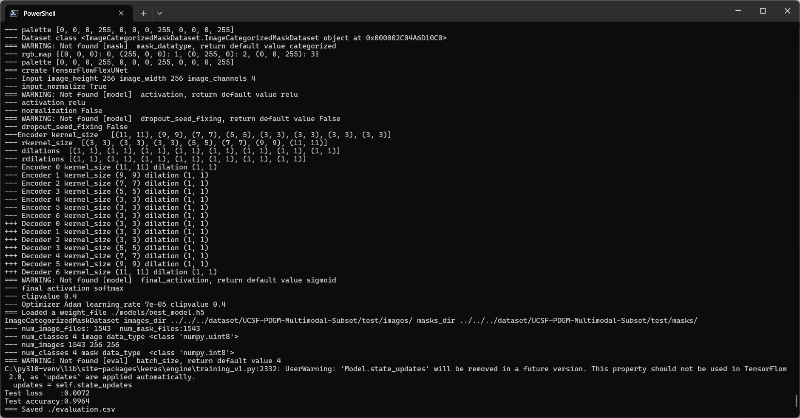
  Image-Segmentation-UCSF-PDGM-Multimodal

<a href="./projects/TensorFlowFlexUNet/UCSF-PDGM-Multimodal-Subset/evaluation.csv">evaluation.csv</a> 
The loss (categorical_crossentropy) to this UCSF-PDGM-Multimodal-Subset/test was low, and dice_coef_multiclass  
high, as shown below.
 
<pre>
categorical_crossentropy,0.0072
dice_coef_multiclass,0.9964
</pre>
These scores are a little bit better than those of the  
<a href="https://github.com/sarah-antillia/TensorFlow-FlexUNet-Image-Segmentation-UCSF-PDGM-Multimodal-Combined-Subset">
Multimodal Combined case.</a>
 
<pre>
categorical_crossentropy,0.0096
dice_coef_multiclass,0.9952
</pre>
 
<h3>
5. Inference
</h3>
Please move to <b>./projects/TensorFlowFlexUNet/UCSF-PDGM-Multimodal</b> folder
and run the following bat file to infer segmentation regions for images using the trained TensorFlowUNet model for
 UCSF-PDGM-Multimodal. 
<pre>
>./3.infer.bat
</pre>
This simply runs the following command.
<pre>
>python ../../../src/TensorFlowFlexUNetInferencer.py ./train_eval_infer.config
</pre>

<b>mini_test_t2_slices</b> 
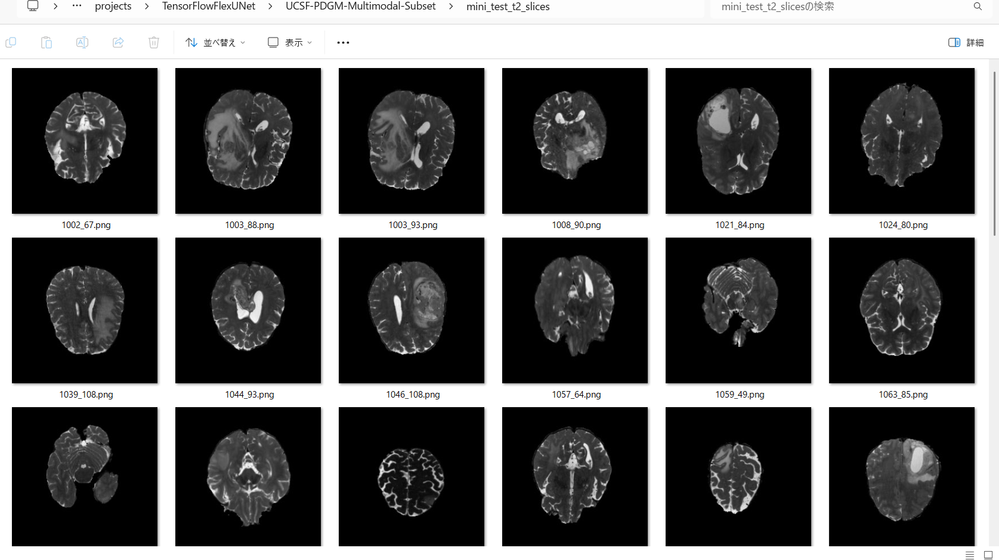 
<b>mini_test_mask(ground_truth)</b> 
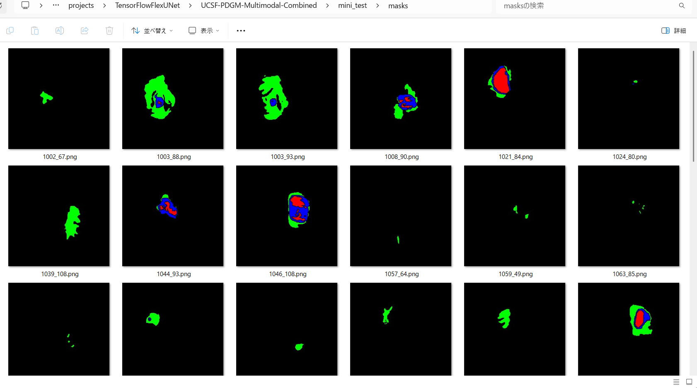 

<b>Inferred test masks</b> 
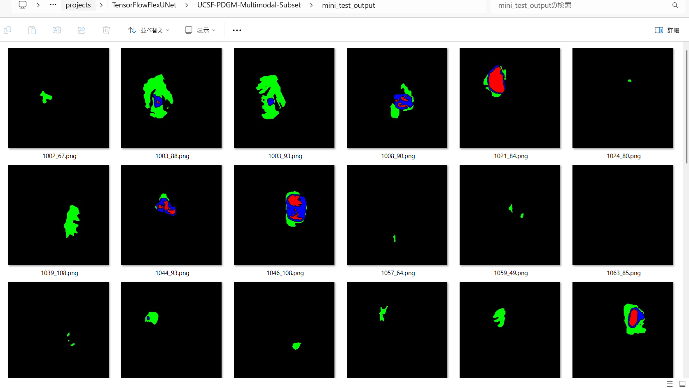 
 

<b>Enlarged images and masks for UCSF-PDGM-Multimodal  Images of 256x256 pixels</b> 
As shown below, the inferred masks look similar to the ground truth masks. 
 
<a href="#1"><b>class-color-mapping-talbe</b></a> 
 
<table>
<tr>
<th>T2 slice in NPY</th>
<th>Mask (ground_truth)</th>
<th>Inferred-mask</th>
</tr>
<tr>
<td>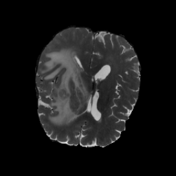</td>
<td>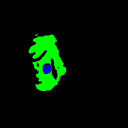</td>
<td>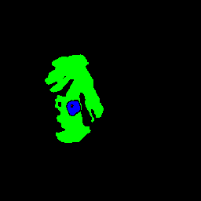</td>
</tr>
<tr>
<td>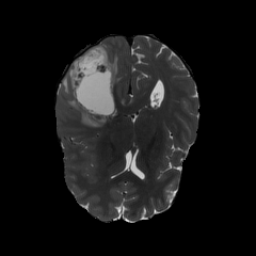</td>
<td>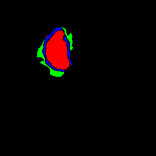</td>
<td>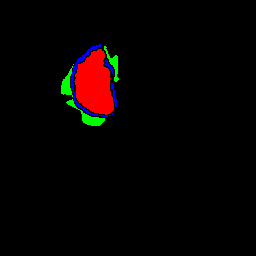</td>
</tr>
<tr>
<td>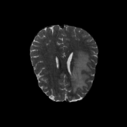</td>
<td></td>
<td>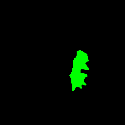</td>
</tr>
<tr>
<td></td>
<td></td>
<td></td>
</tr>
<tr>
<td>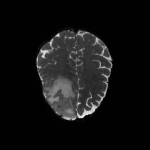</td>
<td>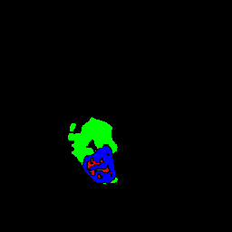</td>
<td>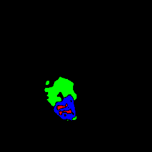</td>
</tr>
<tr>
<td>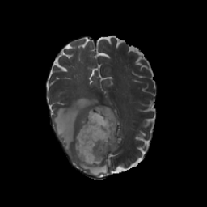</td>
<td></td>
<td>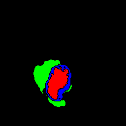</td>
</tr>
</table>

 
<!--
<h3>
6. 3D Volume Segmentation
</h3>
Please move to <b>./projects/TensorFlowFlexUNet/UCSF-PDGM-Multimodal</b> folder
and run the following bat file to infer image segmentation for 2D slices of 3D volume NIfTI files
 using the trained TensorFlowFlexUNet model for UCSF-PDGM-Multimodal. 
<pre>
>./5.infer3d.bat
</pre>
This simply runs the following command.
<pre>
>python ../../../src/TensorFlowFlexUNet3DInferencer.py ./train_eval_infer.config
</pre>
<b>infer3d section </b> in <a href="./projects/TensorFlowFlexUNet/UCSF-PDGM-Multimodal-Subset/train_eval_infer.config">
train_eval_infer.config
<a></b>
<pre>
[infer3d] 
; Specify an images_dir which contains NIfTI or NPY files
images_dir    = "./mini_test_3d/images/"
output_dir    = "./mini_test_3d_output/"
slice_shape_order = "hwd"
slice_normalize = True
slice_resize   = (256,256)
; Specify a cv2.rotation mode as a string.
slice_rotation = "cv2.ROTATE_90_COUNTERCLOCKWISE" 

mask_overlay  = True
</pre>

<b>Acutual Image Segmentation for 2D Slices of a UCSF-PDGM-Multimodal NIfTI</b> 
Some Slices, Inferred Masks and Mask overlays for a 3D volume <b>UCSF-PDGM-0004_T2.nii</b> file in 
<b>ucsf</b> folder. 
 
<a href="#1"><b>class-color-mapping-talbe</b></a> 
 
<table>
<tr>
<th width="320" height="auto">Combined Image</th>
<th width="320" height="auto">Inferred-mask</th>
<th width="320" height="auto">Mask overlay</th>
</tr>

<tr>
<td></td>
<td></td>
<td></td>
</tr>

<tr>
<td></td>
<td></td>
<td></td>
</tr>
<tr>
<td></td>
<td></td>
<td></td>
</tr>
<tr>
<td></td>
<td></td>
<td></td>
</tr>
<tr>
<td></td>
<td></td>
<td></td>
</tr>
<tr>
<td></td>
<td></td>
<td></td>
</tr>
</table>

 
<h3>
7. MaskOverlay Video of 3D Volume Segmentation
</h3>
Please move to the <b>./projects/TensorFlowFlexUNet/UCSF-PDGM-Multimodal</b> folder and run the following bat file 
to generate <b>overlays.mp4</b> or <b>overlay.gif</b> for MaskOverlays of 3D Volume Segmentation.  
<pre>
>./6.video3d.bat
</pre>
This simply runs the following command.
<pre>
>python ../../../src/MaskOverlayVideoGenerator.py ./train_eval_infer.config
</pre>
 
<b>infer3d section </b> in <a href="./projects/TensorFlowFlexUNet/UCSF-PDGM-Multimodal-Subset/train_eval_infer.config">
train_eval_infer.config
<a></b>
<pre>
[infer3d] 
mask_overlay  = True
; Specify ".mp4" or ".gif".
;video_fileformat  = ".mp4"
video_fileformat  = ".gif"
</pre>
 
<b>overlays.gif</b> 

 
-->
 
<h3>
References
</h3>
<b>1. TensorFlow-FlexUNet-Image-Segmentation-Multiclass-BraTS2023-Subset</b> 
Toshiyuki Arai 
<a href="https://github.com/sarah-antillia/TensorFlow-FlexUNet-Image-Segmentation-Multiclass-BraTS2023-Subset">
https://github.com/sarah-antillia/TensorFlow-FlexUNet-Image-Segmentation-Multiclass-BraTS2023-Subset
</a>
  
<b>2. TensorFlow-FlexUNet-Image-Segmentation-BraTS-Africa-Glioma-T2W</b> 
Toshiyuki Arai 
<a href="https://github.com/sarah-antillia/TensorFlow-FlexUNet-Image-Segmentation-BraTS-Africa-Glioma-T2W">
https://github.com/sarah-antillia/TensorFlow-FlexUNet-Image-Segmentation-BraTS-Africa-Glioma-T2W
</a>
  
<b>3. TensorFlow-FlexUNet-Image-Segmentation-Multiclass-BraTS2020</b> 
Toshiyuki Arai 
<a href="https://github.com/sarah-antillia/TensorFlow-FlexUNet-Image-Segmentation-Multiclass-BraTS2020">
https://github.com/sarah-antillia/TensorFlow-FlexUNet-Image-Segmentation-Multiclass-BraTS2020
</a>
  
<b>4. TensorFlow-FlexUNet-Image-Segmentation-UCSF-PDGM-FLAIR-Subset</b> 
Toshiyuki Arai 
<a href="https://github.com/sarah-antillia/TensorFlow-FlexUNet-Image-Segmentation-UCSF-PDGM-FLAIR-Subset">
https://github.com/sarah-antillia/TensorFlow-FlexUNet-Image-Segmentation-UCSF-PDGM-FLAIR-Subset</a>
  
<b>5 TensorFlow-FlexUNet-Image-Segmentation-UCSF-PDGM-Combined-Subset</b> 
Toshiyuki Arai 
<a href="https://github.com/sarah-antillia/TensorFlow-FlexUNet-Image-Segmentation-UCSF-PDGM-Multimodal-Combined-Subset">
https://github.com/sarah-antillia/TensorFlow-FlexUNet-Image-Segmentation-UCSF-PDGM-Multimodal-Combined-Subset</a>
  
<b>6 TensorFlow-FlexUNet-Image-Segmentation-Model</b> 
Toshiyuki Arai 
<a href="https://github.com/sarah-antillia/TensorFlow-FlexUNet-Image-Segmentation-Model">
https://github.com/sarah-antillia/TensorFlow-FlexUNet-Image-Segmentation-Model
</a>
  
